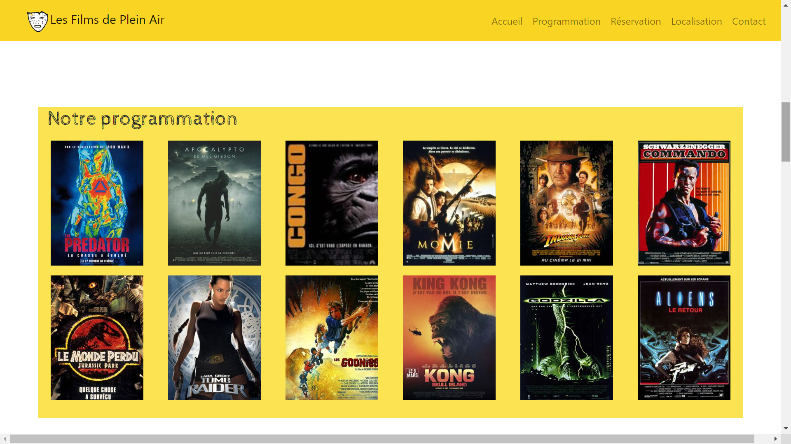
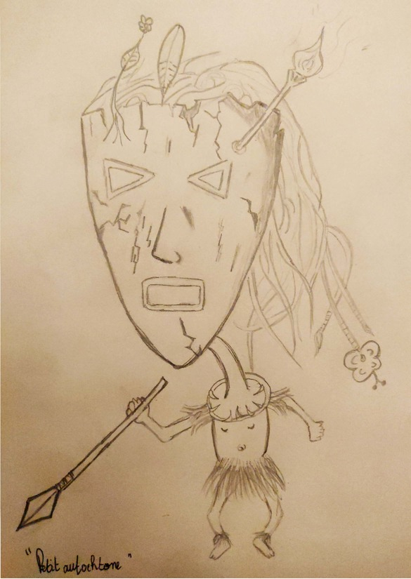
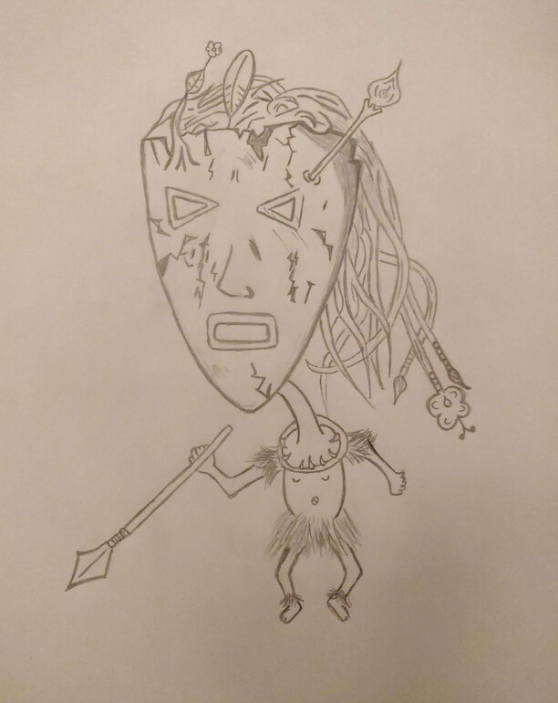

# *Présentation de la maquette pour le festival de plein air* 

* La techniche de Webdesign onePage à été choisi pour la création de cette maquette  
* l’intégralité du contenu défile et s'affiche sur une page unique  
* La maquette à été codé avec les technologies HTML5/CSS3 et bootsrap  
* Le design du hero-header a été dessiné à la main puis vectorisé avec adobe illustrator et retouché avec photoshop

## Hero-header

## Introduction

## Selection

## Programme

## Module de reservation

## Localisation du festival

## Formulaire de contact

## Design du hero-header

